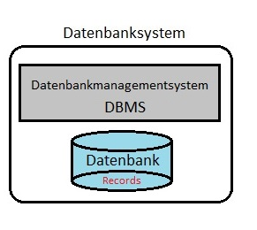
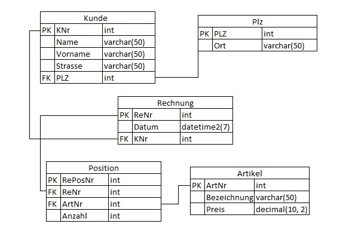

Datenbank
---------

###Was ist eine Datenbank?

* Alle wichtigen Informationen werden in einer Datenbank abgelegt
* Es ist elektronisches Verwaltungssystem

###Woraus besteht eine Datenbank?

Eine Datenbank(-system/ DBS) besteht aus zwei Teilen:

1. Bereitgestellte Informationen werden in Datensätzen (Records) gebündelt und in der Datenbank hinterlegt
2. Software zur Verwaltung der Datenbank, Datenbankmanagementsystem (DBMS)

###DBMS - Was ist das?

Es werden die Grundlagen der Datenbank festgelegt. Die Grundlage für eine Datenbank ist das Datenbankmodell. Das DBMS ist zuständig für die:

* Sicherheit
* Transaktion
* Integrität
* Anfrageoptimierung
* Anwendungsunterstützung
* Sprachen
* DML, DDL, DCL
* Mehrbenutzerfähigkeit
* Konsistenz
* Backup

###Datenbankmodell

Es werden die Grundlagen der Datenbank festgelegt. Die Grundlage für eine Datenbank ist das Datenbankmodell. Das DBMS ist zuständig für die:

* Generische Datenstruktur
* Generische Operatoren
* Integritätsbedingungen

Das weitverbreitetste Datenbankmodell ist das relationale Datenbankmodell.

###Relationales Datenbankmodell

Sie stellt eine mathematische Beschreibung einer Tabelle und ihre Beziehung zu anderen möglichen Tabellen dar. Des Weiteren ist die relationale Algebra auch die Grundlage für die Datenbanksprache SQL. Relationale Datenbankmodelle sind vergleichsweise mit anderen Modellen sehr einfach und flexibel zu erstellen und zu steuern.   
Die Datenbank kann man sich unter einer Sammlung von Tabellen und Beziehungen vorstellen, die miteinander verknüpft sind. Jede Zeile (auch Tupel genannt) in einer Tabelle ist ein Datensatz (record). Jedes Tupel besteht aus einer großen Reihe von Attributen (Eigenschaften), den Spalten der Tabelle. Ein Relationsschema legt dabei die Anzahl und den Typ der Attribute für eine Tabelle fest.

Des Weiteren können Verknüpfungen (Beziehungen) über sogenannte Primärschlüssel hergestellt werden, um bestimme Attribute, die den gleichen Primärschlüssel oder in einer Detailtabelle als Fremdschlüssel besitzen, abzufragen. 
